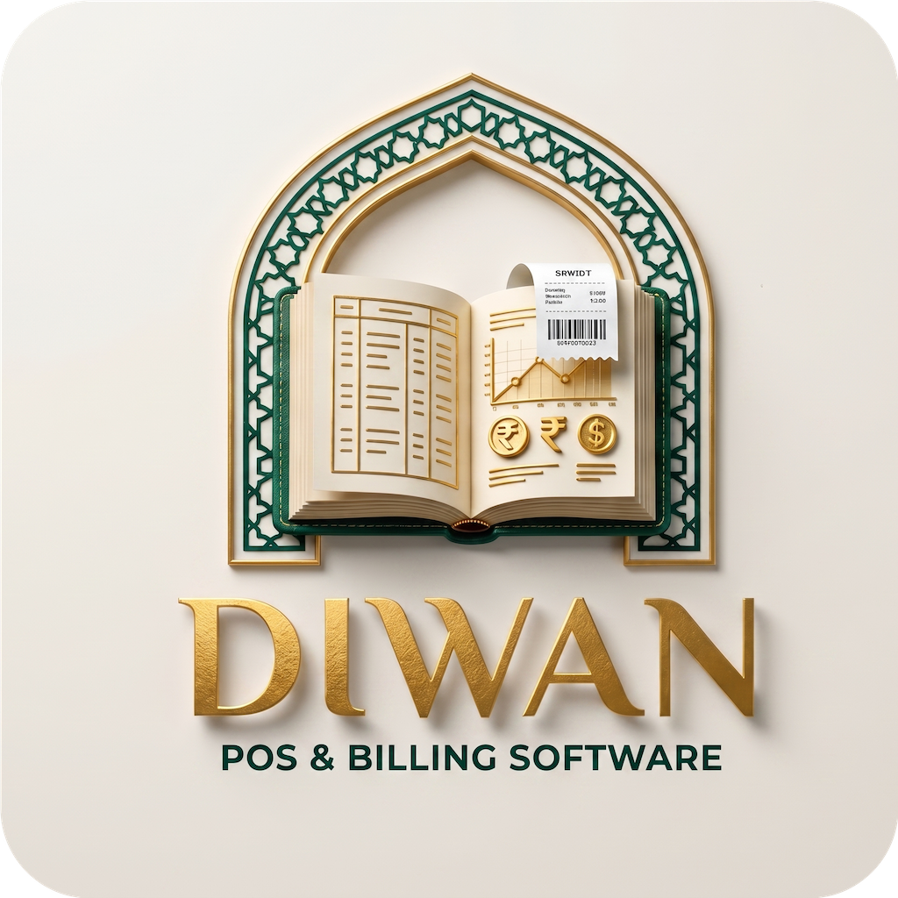

<div align="center">



# Diwan

**An offline-first, white-label point of sale for small retail and restaurant businesses.**

One codebase, configured per client — modules are toggled on or off per
installation rather than forked into separate builds.

[](#system-requirements)
[](https://tauri.app)
[](https://react.dev)
[](https://www.rust-lang.org)
[](LICENSE)

</div>

---

## Why Diwan

Most shop software assumes a reliable internet connection, a modern machine, and
a tech-savvy operator. Diwan assumes none of them.

- **Works with the internet unplugged.** Every core task — billing, inventory,
  reports, attendance — runs against a local SQLite database. No server, no
  account, no sync step that can fail mid-sale.
- **Fast on old hardware.** A native Rust backend and no bundled browser
  runtime, so it stays responsive on the low-spec PCs small shops actually run.
- **Configured, not coded, per client.** A retail shop and a restaurant install
  the same build; a first-run wizard and the Settings screen decide which
  modules each one sees.
- **Safe for daily money handling.** Each sale is a single SQLite transaction,
  all amounts are stored as integer minor units, and historic prices are frozen
  at checkout so a later price change can never rewrite yesterday's receipts.

## Features

| Module | What it does | Toggleable |
| --- | --- | --- |
| **Billing / POS** | Barcode-scan-friendly search, category browsing, per-item notes, discounts, tax, dine-in tables, PDF & ESC/POS receipts | Core — always on |
| **Inventory** | Stock levels, categories, low-stock alerts, product photos, CSV bulk import | Yes |
| **Tables** | Restaurant floor view, park-and-resume orders | Yes |
| **Reports** | Sales summaries, top items, PDF & CSV export | Yes |
| **Attendance** | Staff check-in/out, monthly summaries | Yes |
| **Expenses** | Categorized expense logging | Yes |
| **Salary** | Attendance-driven salary calculation and payment tracking | Yes |
| **Dashboard** | Daily snapshot and trend, aggregated from whatever modules are enabled | Yes |
| **Settings & Users** | Module toggles, PIN accounts, roles (Owner / Admin / Cashier) | Admin-only, always present |

A first-run **setup wizard** walks a new installation through business info →
suggested module defaults → module toggles, so a new client is configured into
existence rather than built.

## Screenshots

> _Add screenshots of the billing screen, dashboard, and setup wizard here._

## Getting started

**Prerequisites** — [Node.js 18+](https://nodejs.org),
[Rust (stable)](https://rustup.rs), and the
[Tauri 2 system dependencies](https://tauri.app/start/prerequisites/) for your
platform.

```bash
git clone https://github.com/hmzi67/point-of-sale.git
cd point-of-sale
npm install
npm run tauri dev
```

Debug builds seed a demo shop and an **Owner** account with PIN **`1234`** —
sign in with that and change it from the Users screen. A production build
launches straight into the first-run setup wizard instead.

### Commands

| Command | What it does |
| --- | --- |
| `npm run tauri dev` | Run the desktop app (Vite on `:1420`, then cargo) |
| `npm run tauri build` | Production installer (`.dmg`, `.msi`, `.AppImage`, …) |
| `npm run dev` | Vite only, in-browser — `invoke()` calls will fail here |
| `npm run build` | `tsc --noEmit` typecheck + `vite build` |

Rust-only checks, run from `src-tauri/`:

```bash
cargo check
cargo fmt
cargo clippy
cargo test                    # single test: cargo test <name_substring>
```

There is no frontend linter or test runner configured; the safety net on that
side is `tsc --noEmit` plus manual testing against `docs/TESTING_CHECKLIST.md`.

## System requirements

| Platform | Minimum |
| --- | --- |
| **Windows** | 10 or later (64-bit), with WebView2 |
| **macOS** | 10.15 Catalina or later |
| **Linux** | Any distribution with `webkit2gtk` 4.1 |
| **Android** | Not yet finalized — see the Android job in `.github/workflows/release.yml` |

Windows 7/8/8.1 are **not supported**: WebView2, which Tauri relies on for the
UI, dropped them in January 2023 and Microsoft no longer distributes a
compatible runtime. An NSIS preinstall check (`src-tauri/windows/hooks.nsh`)
stops with a plain-language message before touching anything on such a machine.
The installer uses the small `downloadBootstrapper` webview install mode, so a
Windows 10+ machine needs internet access on first install to fetch WebView2 if
it is not already present — `docs/DEPLOYMENT.md` covers the size/offline
trade-off this implies.

## Architecture

```
src/
  components/<module>/   per-module components (layout/, billing/, inventory/, …)
  pages/                 one screen per module
  hooks/, store/         shared hooks and Zustand stores
  services/              typed wrappers over Tauri commands — all IPC goes through here
  types/, utils/         shared domain types, formatting, nav catalogue
src-tauri/src/
  commands.rs            every #[tauri::command]
  session.rs             server-side session — the source of truth for role checks
  db/schema.sql          the whole schema (ER summary in its header comment)
  db/schema.rs           migration runner + first-run seeding
  db/{config,items,sales,tables,attendance,expenses,salary,dashboard,csv_import}.rs
  printer/escpos.rs      ESC/POS byte-building; USB send via rusb
```

A few invariants worth knowing before changing anything:

- **All SQLite access lives in Rust.** Components never call `invoke()` —
  `src/services/tauriClient.ts` is the only module that imports
  `@tauri-apps/api`, and everything else goes through its typed wrappers.
- **Money is integer minor units** (paisa/cents) in every column, suffixed
  `_minor`. Never floats — a till must not accumulate rounding drift.
- **Migrations are additive-only.** `schema.sql` is all
  `CREATE ... IF NOT EXISTS` and is replayed on every launch; a change that must
  *modify* an existing table needs a numbered step guarded on `user_version`.
- **Modules are dynamic.** What a client sees comes from the `enabled_modules`
  table, never from code, intersected with the signed-in user's role.

**`CLAUDE.md` is the canonical architecture reference** — module system, IPC
conventions, database invariants, permission model — and is the doc to read
before contributing, human or AI.

## Documentation

`CLAUDE.md` and this README are tracked in the repository. The remaining
documents live in `docs/`, which is **git-ignored** — they are kept alongside
the working copy but are not published with the source:

| Document | Audience |
| --- | --- |
| `docs/projectGoal.md` | Product goals and the white-label philosophy |
| `docs/buildPlan.md` | Phase-by-phase build history |
| `docs/ADMIN_GUIDE.md` | Non-technical guide for shop owners and staff |
| `docs/DEPLOYMENT.md` | Building, signing, and shipping installers |
| `docs/TESTING_CHECKLIST.md` | Manual QA pass before a release |
| `docs/SUPPORT.md` | Vendor-only recovery notes — **not client-facing** |

## Contributing

This is a proprietary product, not an open-source project; it does not accept
outside contributions. If you have been granted access to work on it, read
`CLAUDE.md` first, keep changes inside the phase structure of
`docs/buildPlan.md`, and run `cargo test`, `cargo clippy`, and `npm run build`
before opening a pull request.

## License

Copyright © 2026 Applr. All rights reserved.

Diwan is proprietary software, licensed rather than sold. Possession of this
repository grants no rights to use, copy, modify, or redistribute it — those
are granted only under a separate written agreement with Applr. See
[LICENSE](LICENSE) for the full terms.
